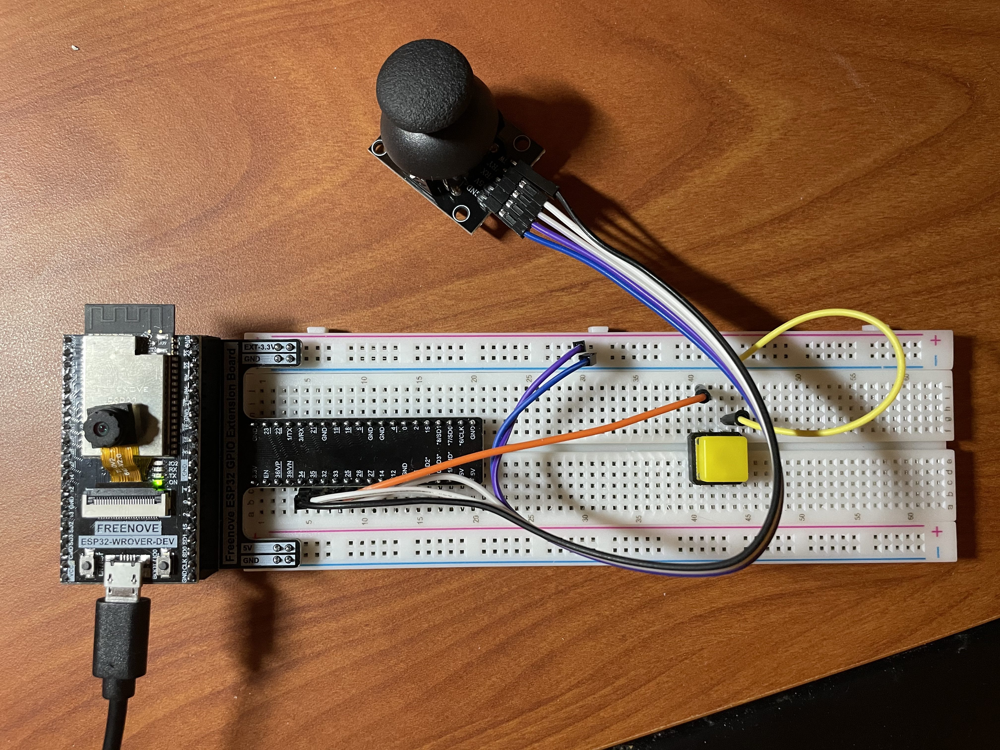
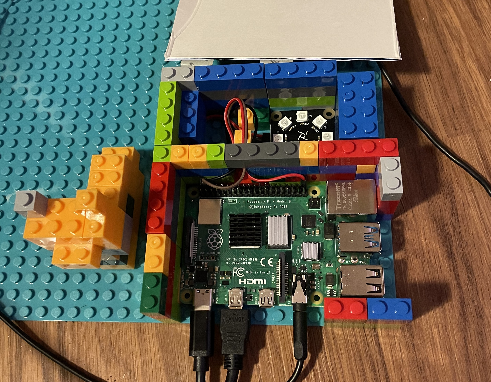

# schrodingers_cat

# Overview
This art is inspired by the idea of Schrodinger’s Cat and a previous project Stay Connected. According to Wikipedia, Schrodinger’s cat is a thought experiment that a hypothetical cat may be considered simultaneously both alive and dead as a result of being linked to a random event that may or may not occur. Stay Connected is a generative art about interpersonal relationship during the Covid pandemic.

In this project, there is a black box that represents the box in the thought experiment. There is a hypothetical cat (the Raspberry Pi) in the black box. The cat is mysteriously linked to the Covid virus. At any time, the cat could be infected by Covid and die. The cat’s life status is indicated by the LED light in the box. The eight LED lights also encode the binary number of total confirmed cases in million. The green lights means the cat is alive and red lights means the cat is dead. However, without opening the black box, no one could know if the cat is dead or alive.

To give people outside of the box a bit more information and control, there is a wireless controller made by an ESP32. The controller has two components: a joystick and a push button. Pushing the button will “call” the cat inside the box. If the cat is alive, it may respond to your call by sounding a “meow” through the speaker. However, cats are unruly! Her responsiveness totally depend on her mood, so she may simply ignores you. Therefore, if you push the button and the cat responded, she is definitely alive. But if she didn’t respond, there are two possibilities: she could be dead, or she is alive but ignored you. Moving the joystick can effect the cat’s life or death. However, the effect is unknown: it may shorten its life, extend it, or have no effect. The whole point is: “you don’t know!”

The combinatorial aspect is that I reused some code in the project Stay Connected, especially the idea of showing the number of Covid cases in binary form.

# To Reproduce

Hardware:
In the project, an ESP32 (the controller) and a Raspberry Pi are used. The code to program the ESP32 and the Raspberry Pi can be found at the Git Repo. There is also a joystick, a push button and a few wires to make up the controller. Also, there is an LED light connected to the Raspberry Pi. To set up the project, you will also need a computer with [Arduino IDE](https://www.arduino.cc) installed to program the ESP32, and a monitor, keyboard and mouse to control the Raspberry Pi. I also make the black box with LEGO blocks and a black paper cover.

  

Once set up the hardware, upload the Arduino sketch in UDP_AP/ to the ESP32 controller. You can modify the wifi name and password as needed in UDP_AP/UDP_AP.ino. Then connect the raspberry pi to the wifi you set up in ESP32, and run the python script led.py.
